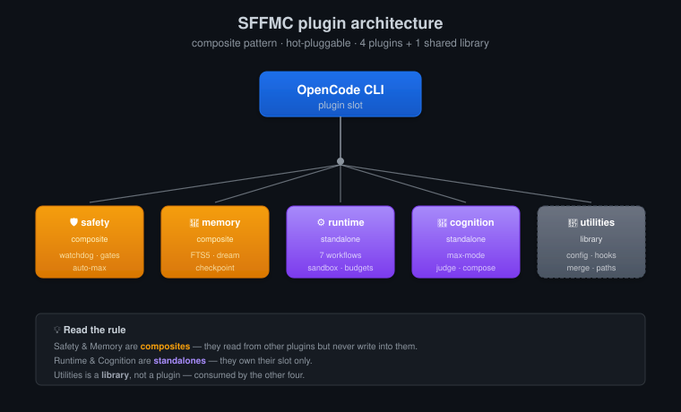
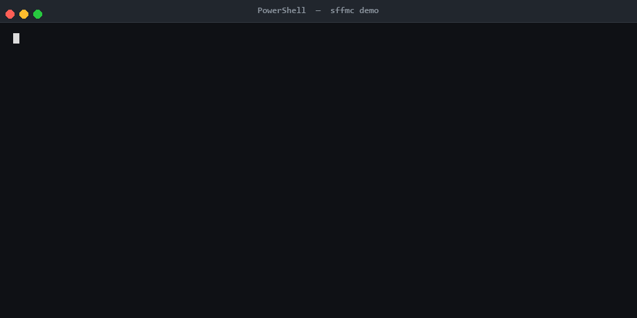

<div align="center">

<picture>
  <source media="(prefers-color-scheme: dark)" srcset="docs/assets/logo-dark.svg" />
  
</picture>

### Плагины OpenCode, портированные из Xiaomi MiMo-Code — drop in, без форка

[**🚀 Быстрый старт**](#-быстрый-старт) · [**📖 Документация**](./docs/getting-started.md) · [**💬 Changelog**](./CHANGELOG.md) · [**🤝 Contributing**](./CONTRIBUTING.md)

[](https://github.com/Rahspide/sffmc/releases/latest)
[](https://www.npmjs.com/~Rahspide)
[](https://bun.sh)
[](./CONTRIBUTING.md)
[](./LICENSE)
[](https://github.com/Rahspide/sffmc/stargazers)

[🇬🇧 English](./README.md) · [🇷🇺 Русский](./README.ru.md)

</div>

---

## ⚡ TL;DR

```bash
# 1. Установи все 5 пакетов
npm install -g @sffmc/runtime @sffmc/cognition @sffmc/memory @sffmc/safety @sffmc/utilities

# 2. Добавь в ~/.config/opencode/opencode.json
# 3. Перезапусти OpenCode
# 4. Проверь
```

Готово. Без форка, без патчей, без пересборки.

---

## 🤔 Зачем SFFMC?

<table>
<tr>
<th width="50%">Голый OpenCode</th>
<th width="50%">OpenCode + SFFMC</th>
</tr>
<tr>
<td>Скрипты воркфлоу пишешь сам</td>
<td>⚙️ 7 встроенных воркфлоу (`deep-research`, `security-audit`, `refactor`, `plan`, `tdd`, `doc-gen`, `lib-migrate`)</td>
</tr>
<tr>
<td>Между сессиями всё забыто</td>
<td>💾 FTS5-память + dream-консолидация</td>
</tr>
<tr>
<td>Опасные вызовы проскакивают</td>
<td>🛡️ 5-слойный safety gate + auto-max эскалация</td>
</tr>
<tr>
<td>Один ответ на вопрос</td>
<td>🧠 Max-mode с LLM-as-judge — выбирает лучший из N кандидатов</td>
</tr>
<tr>
<td>Нет health-видимости</td>
<td>🔬 13 диагностик monorepo</td>
</tr>
</table>

**Название — небольшая шутка над upstream-проектом:** **S**ome **F**eature **f**rom **M**imo **C**ode.

---

## ✨ Что внутри?

<table>
<tr>
<td width="50%" valign="top">

### ⚙️ Workflow engine
JS-скрипты в песочнице с бюджетами, resume и дочерними воркфлоу. Пиши свои или копируй из 7 встроенных.

</td>
<td width="50%" valign="top">

### 🛡️ Safety gates
Ловит деструктивные операции до того, как они попадут на диск. Авто-восстановление после сбоя tools. Авто-эскалация в max-mode, если модель застряла.

</td>
</tr>
<tr>
<td width="50%" valign="top">

### 💾 Кросс-сессионная память
FTS5-поиск, checkpoint-журналирование, dream-консолидация. Контекст переживает между чатами — модель помнит вчерашние решения.

</td>
<td width="50%" valign="top">

### 🧠 Max-mode рассуждения
Генерирует N параллельных кандидатов, выбирает лучший через LLM-as-judge. Качество выше без оплаты за ретраи.

</td>
</tr>
</table>

[📖 Полный список фич →](./docs/mimo-code-features.md)

---

## 📦 Пять пакетов

| Пакет | Роль | Тип | Версия |
|---|---|---|---|
| [`@sffmc/runtime`](./packages/runtime) | Sandbox-оркестратор воркфлоу + 7 встроенных | Standalone plugin |  |
| [`@sffmc/cognition`](./packages/cognition) | Max-mode рассуждения, compose, health-диагностика | Standalone plugin |  |
| [`@sffmc/memory`](./packages/memory) | Кросс-сессионная память, judge, dream, checkpoint | **Composite** plugin |  |
| [`@sffmc/safety`](./packages/safety) | Watchdog, safety gates, auto-max | **Composite** plugin |  |
| [`@sffmc/utilities`](./packages/utilities) | Общий SDK — config, event-bus, hooks, paths | Library (без plugin slot) |  |

> **Composite** плагины могут читать состояние других SFFMC-плагинов, но писать только в свой слот. `utilities` потребляется остальными четырьмя и никогда не появляется в твоём `plugin` массиве.

---

## 🚀 Быстрый старт

Выбери способ установки, который тебе подходит:

### Вариант A — npm (самый простой)

```bash
npm install -g @sffmc/runtime @sffmc/cognition @sffmc/memory @sffmc/safety @sffmc/utilities
```

Добавь четыре плагина в `~/.config/opencode/opencode.json` (порядок важен — composites первыми):

```jsonc
{
  "plugin": [
    "@sffmc/safety",    // composite: ловит деструктивные операции
    "@sffmc/memory",    // composite: подгружает прошлый контекст
    "@sffmc/runtime",   // standalone: workflow engine
    "@sffmc/cognition"  // standalone: max-mode рассуждения
  ]
}
```

Перезапусти OpenCode. Проверь установку:

```
/sffmc_health
```

В терминале должны пробежать 13 диагностик. ✅

### Вариант B — one-liner (клонирует репо + авто-конфигурирует)

```bash
# macOS / Linux (нужен SSH-ключ на GitHub)
curl -fsSL https://raw.githubusercontent.com/Rahspide/sffmc/main/install.sh | sh

# Windows PowerShell
irm https://raw.githubusercontent.com/Rahspide/sffmc/main/install.ps1 | iex
```

Скрипт клонирует репо, запускает `sffmc init` и правит `opencode.json` за тебя. Целевую ветку можно переопределить через `SFFMC_VERSION=v0.16.3`.

### Вариант C — из исходников

```bash
git clone https://github.com/Rahspide/sffmc.git ~/.sffmc/plugins/sffmc
cd ~/.sffmc/plugins/sffmc
./install.sh
```

> 📖 **Полный гайд** (пиннинг версий, troubleshooting, платформенные заметки):
> [docs/install.md →](./docs/install.md)

---

## 🔧 CLI-справочник

Каждая установка поставляет бинарь `sffmc`:

| Команда | Что делает |
|---|---|
| `sffmc init` | Ре-синк `opencode.json` с 4 плагинами |
| `sffmc init --all` | Установить все 5 пакетов (включая `utilities` library) |
| `sffmc init --yes` | Пропустить подтверждение |
| `sffmc update` | `git pull` + повторный `init` |
| `sffmc doctor` | Запустить 9-check диагностику |
| `sffmc uninstall` | Удалить все SFFMC-записи из `opencode.json` |

> 💡 Запускай `sffmc doctor` после любого апгрейда OpenCode — он ловит проблемы с порядком загрузки плагинов, пропавшие зависимости и config-drift.

---

## 🏗️ Архитектура

SFFMC следует **composite pattern**:
- **Каждый плагин свободно читает** состояние других плагинов.
- **Каждый плагин пишет только в свой слот** — никакого общего мутируемого состояния.
- **Hot-pluggable** — добавляй или убирай пакет, не трогая остальные.



**Hook-категории** (диспатчатся через `mergeHooks` из `@sffmc/utilities`):

| Категория | Семантика | Ключи |
|---|---|---|
| `TRANSFORM` | Цепочка (первый → последний) | `experimental.chat.messages.transform`, `experimental.chat.system.transform`, `experimental.text.complete` |
| `GATE` | Первый truthy побеждает | `tool.execute.before`, `tool.execute.after`, `permission.ask`, `command.execute.before` |
| `SIDE_EFFECT` | Все бегут, возврат игнорируется | `config`, `event`, `experimental.session.start`, `experimental.session.end` |
| `tool` | Последний побеждает + warn | регистрация определений tools |

> 📖 **Полный SDK-референс**: [CONTRIBUTING.md →](./CONTRIBUTING.md)

---

## 🎬 Демо: safety gate ловит `rm -rf`



*Реальная SFFMC-сессия — `@sffmc/safety` сразу **deny**-ит `rm -rf /` (строка `Error: [Rules] DENIED: ...` — дословный вывод из `packages/safety/src/rules/index.ts`). Для менее опасного `rm -rf /tmp/build` срабатывает **ask** — лог `WARN`, OpenCode показывает свой permission-диалог, юзер жмёт **Deny**.*

---

## 🧪 Quality gates

Каждый коммит прогоняет 7-ступенчатую gate-цепочку. Скрипт `precommit` запускает те же гейты локально:

| # | Gate | Что проверяет |
|---|---|---|
| 1 | 🚿 **Cleanroom** | Запрещённые идентификаторы, внешние URL, regex по workflow-терминам |
| 2 | ⚡ **ReDoS audit** | `safe-regex` по каталогу redaction-rules |
| 3 | 🔗 **Load-order audit** | AST-детекция конфликтов хуков |
| 4 | 🧪 **Test suite** | 1946 тестов в 109 файлах |
| 5 | 💚 **Health summary** | 13 диагностик monorepo |
| 6 | 📝 **Typecheck** | `bun build --no-bundle` |
| 7 | 🔒 **Install frozen** | `bun install --frozen-lockfile` |

```bash
bun run precommit   # запускает гейты 1–7 локально перед push
```

> `bun.lock` регенерируется на каждый bump версии, чтобы пины в workspace синхронизировались с манифестами.

---

## 📚 Документация

| Док | Что внутри |
|---|---|
| [📥 Начало работы](./docs/getting-started.md) | Установка, первый воркфлоу, отладка |
| [⚙️ Dynamic workflow](./docs/dynamic-workflow.md) | Внутренности sandbox, бюджеты, модель ошибок |
| [🧪 Примеры воркфлоу](./docs/workflow-examples.md) | 5 копипастных воркфлоу |
| [📥 Гайд по установке](./docs/install.md) | Ручная установка, платформенные заметки |
| [🚀 Drone CI](./docs/drone-ci.md) | Референс CI-pipeline |
| [✨ Фичи MiMo](./docs/mimo-code-features.md) | Что портировано, что нет |

---

## 🤝 Contributing

1. **Fork** репо.
2. **Ветка** с говорящим именем: `feature/<slug>` или `fix/<slug>`.
3. **Код с тестами** — покрытие важно. Новая hook-категория? Добавь регрессионный тест и прогони `bun run audit:load-order`.
4. **Запусти** локальный gate: `bun run precommit`.
5. **Push** и **открой PR** — CI прогоняет те же 7 гейтов.

См. [CONTRIBUTING.md](./CONTRIBUTING.md) для референса plugin SDK, hook-категорий и архитектурных решений.

**Локальный dev-флоу** — клонируй репо, затем добавь `file://`-записи в свой `opencode.json`, указывающие на твою рабочую копию:

```jsonc
{
  "plugin": [
    "file:///path/to/sffmc/packages/safety",
    "file:///path/to/sffmc/packages/memory",
    "file:///path/to/sffmc/packages/runtime",
    "file:///path/to/sffmc/packages/cognition"
  ]
}
```

Твои правки hot-reload-ятся — не нужно переустанавливать.

---

## 📝 License

[MIT](./LICENSE) — см. файл для полного текста. Часть функциональности адаптирована из [Xiaomi MiMo-Code](https://github.com/XiaomiMiMo/MiMo-Code) под upstream-лицензией.

---

<sub align="center">Собрано с 🧡 от <a href="https://github.com/Rahspide">@Rahspide</a> · Powered by <a href="https://bun.sh">Bun</a> · Inspired by <a href="https://github.com/XiaomiMiMo/MiMo-Code">Xiaomi MiMo-Code</a></sub>
